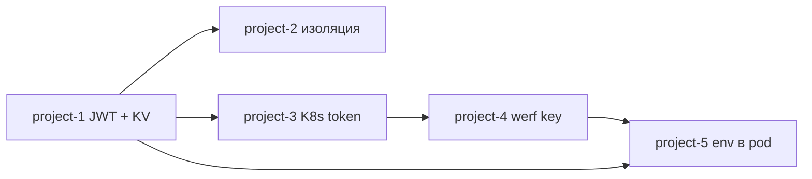
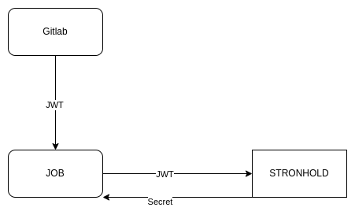

# GitLab CI и Stronghold

Примеры GitLab-проектов с `.gitlab-ci.yml`: секреты хранятся в **Stronghold** (аналог HashiCorp Vault), а не в переменных GitLab и не в коде. Пайплайн получает доступ «на лету» через JWT, который GitLab выпускает для каждой job. Токены и динамические учётные данные краткоживущие — их не нужно вручную ротировать в CI.

Преднастройка Stronghold для всех примеров — в каталоге [`terraform/`](../terraform/). Перед запуском пайплайнов примените соответствующие манифесты (`05-gitlab`, `06-gitlab-deploy`, `07-werf-secret-key`).

## Примеры

Проекты лежат в группе [`project-group/`](project-group/). Рекомендуемый порядок просмотра — по возрастанию номера.

| № | Проект | О чём | Terraform | CI |
|---|--------|-------|-----------|-----|
| 1 | [project-1](project-group/project-1/README.md) | JWT → Stronghold → KV; доступ по `project_path` и по GitLab Environment | [`05-gitlab.tf`](../terraform/05-gitlab.tf) | [`.gitlab-ci.yml`](project-group/project-1/.gitlab-ci.yml) |
| 2 | [project-2](project-group/project-2/README.md) | Изоляция секретов между проектами (тот же механизм, другой `CI_PROJECT_PATH`) | [`05-gitlab.tf`](../terraform/05-gitlab.tf) | [`.gitlab-ci.yml`](project-group/project-2/.gitlab-ci.yml) |
| 3 | [project-3](project-group/project-3/README.md) | Временный токен Kubernetes SA через secrets engine; `werf converge` / `dismiss` | [`06-gitlab-deploy.tf`](../terraform/06-gitlab-deploy.tf) | [`.gitlab-ci.yml`](project-group/project-3/.gitlab-ci.yml) |
| 4 | [project-4](project-group/project-4/README.md) | `WERF_SECRET_KEY` из Stronghold + kube-токен; расшифровка `secret-values` | [`07-werf-secret-key.tf`](../terraform/07-werf-secret-key.tf), [`06-gitlab-deploy.tf`](../terraform/06-gitlab-deploy.tf) | [`.gitlab-ci.yml`](project-group/project-4/.gitlab-ci.yml) |
| 5 | [project-5](project-group/project-5/README.md) | Секреты приложения в pod по `environment` (dev / production); `WERF_SET_SECRETS` | [`05-gitlab.tf`](../terraform/05-gitlab.tf), [`06-gitlab-deploy.tf`](../terraform/06-gitlab-deploy.tf), [`07-werf-secret-key.tf`](../terraform/07-werf-secret-key.tf) | [`.gitlab-ci.yml`](project-group/project-5/.gitlab-ci.yml) |

## Terraform для GitLab CI

| Файл | Назначение |
|------|------------|
| [`terraform/05-gitlab.tf`](../terraform/05-gitlab.tf) | JWT auth method `gitlab`, mount `gitlab-secret`, политики `per-project-access` / `per-project-access-with-env`, роли `read-by-gitlab-project*`, демо-секреты |
| [`terraform/06-gitlab-deploy.tf`](../terraform/06-gitlab-deploy.tf) | Kubernetes secrets engine, роль `deploy_role`, политика `project-deploy-policy`, JWT-роль `deploy-from-gitlab` (ограничена project-3) |
| [`terraform/07-werf-secret-key.tf`](../terraform/07-werf-secret-key.tf) | Mount `werf-secret`, роль `werf-secret-by-gitlab-project`, роль `role-can-read-secret-and-deploy` (project-5) |

Общие переменные в пайплайнах: `STRONGHOLD_ADDR`, audience JWT `gitlab-access-aud`, CLI `d8 stronghold`.

## Схема (project-1)

Аутентификация job по JWT (подробнее в [README project-1](project-group/project-1/README.md)):

## Связь с корневым README

Остальные материалы demo (кластер, SSH, БД, namespaces): [`README.md`](../README.md).
