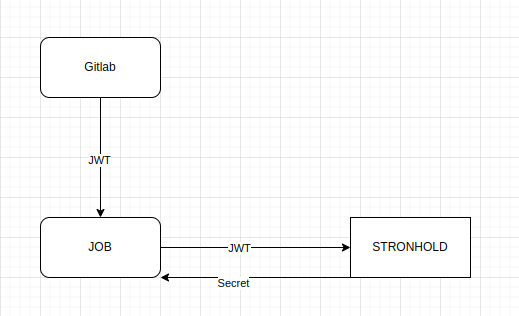

# Аутентификация с помощью JWT

Если есть необходимость доставить секреты из Stronghold в CI/CD пайплайн Gitlab можно воспользоваться схемой аутентификации пайплайна по JWT токену, который создает Gitlab для каждой Job.

Основная идея в том, что доступ выдается на основе параметров, которые присутствуют в подписанном JWT-токене. Скрипты в пайплайне не могут менять содержимое токена, его создает Gitlab на этапе запуска задачи. Доступ существует ограниченное время, и отзывается после истечение TTL.

## Как работает:

При запуске пайплайна гитлаб создает и подписывает JWT-токен, в который помещает информацию о запущенной задаче.

Пример такого токена

```json
{
  "namespace_id": "3",
  "namespace_path": "project-group",
  "project_id": "1",
  "project_path": "project-group/project-1",
  "user_id": "2",
  "user_login": "maksim.kiselev",
  "user_email": "maksim.kiselev@flant.com",
  "user_access_level": "owner",
  "pipeline_id": "5",
  "pipeline_source": "push",
  "job_id": "3",
  "ref": "main",
  "ref_type": "branch",
  "ref_path": "refs/heads/main",
  "ref_protected": "true",
  "runner_id": 1,
  "runner_environment": "self-hosted",
  "sha": "4c0a94fa43ce497bbd389e66f03c7ef5a3b11b13",
  "project_visibility": "private",
  "ci_config_ref_uri": "gitlab.demo-cluster.ru/project-group/project-1//.gitlab-ci.yml@refs/heads/main",
  "ci_config_sha": "4c0a94fa43ce497bbd389e66f03c7ef5a3b11b13",
  "jti": "7f89b9e9-f076-4f44-ae73-0405c210dbbe",
  "iat": 1739203332,
  "nbf": 1739203327,
  "exp": 1739206932,
  "iss": "https://gitlab.demo-cluster.ru",
  "sub": "project_path:project-group/project-1:ref_type:branch:ref:main",
  "aud": "gitlab-access-aud"
}
```

## Настройка Stronghold

На стороне Stronghold можно создать метод аутентификации JWT, который позволит аутентифицироваться на основании JWT токенов Gitlab

```bash
stronghold write auth/gitlab/config \
    oidc_discovery_url="https://gitlab.demo-cluster.ru" \
    bound_issuer="https://gitlab.demo-cluster.ru"
```

При аутиентифкации через auth/gitlab Stronghold проверит, что токен выпущен именно этим Gitlab-ом. Если это не так, то аутентификация не пройдет.

Далее можно создать роль, которая добавит к токену политику myproject-production если JTW соответствует определенным параметрам

```bash
$ stronghold write auth/gitlab/role/myproject-production - <<EOF
{
  "role_type": "jwt",
  "policies": ["myproject-production"],
  "token_explicit_max_ttl": 60,
  "user_claim": "user_email",
  "bound_audiences": "gitlab-access-aud",
  "bound_claims_type": "glob",
  "bound_claims": {
    "project_id": "22",
    "ref_protected": "true",
    "ref_type": "branch",
    "ref": "auto-deploy-*"
  }
}
EOF
```

В данном пример токену будет добавлена политика `myproject-production`  если id проекта 22, запуск произошел из protected-ветки и шаблон имени ветки `auto-deploy-*`


Получить токен для доступа к Stronghold в `.gitlab-ci.yml` можно так:

```yaml
variables:
  STRONGHOLD_ADDR: https://stronghold.domain.tld
job_with_secrets:
  id_tokens:
    MY_ID_TOKEN:
      aud: gitlab-access-aud
  script:
    - export STRONGHOLD_TOKEN=$(d8 stronghold write -field=token auth/gitlab/login role=myproject-production jwt=$MY_ID_TOKEN)
```


Если bound_claims совпадут, будет выпущен токен с политикой `myproject-production`

## Пример для доступа к секретам попроектно

Для начала создадим политику `per-project-access` с шаблоном

```sh
path "gitlab-secret/data/{{identity.entity.aliases.ACCESSOR_NAME.metadata.project_path}}/*" {
  capabilities = ["read"]
}
```

(ACCESOR_NAME - имя вашего auth/gitlab)

Создадим роль read-by-gitlab-project

```bash
$ stronghold write auth/gitlab/role/read-by-gitlab-project - <<EOF
{
  "role_type": "jwt",
  "policies": ["per-project-access"],
  "token_explicit_max_ttl": 60,
  "user_claim": "project_path",
  "bound_audiences": "gitlab-access-aud",
  "claim_mappings": {
    "project_path": "project_path"
  }
}
EOF
```

В случае успешной аутентификации токену будет выдана политика, которая предоставит доступ на чтение секретов по пути:
`gitlab-secret/путь-проекта/в-гитлабе/*`

Если разметить секреты в Stronghold аналогично названиям проектов в гитлабе, то каждый проект получит доступ только к своим секретам (находящимся по соответствующим путям).

Можно усложнить шаблон, и помимо пути к проекту использовать env проекта

Политика `read-by-gitlab-project-env`

```sh
path "gitlab-secret/data/{{identity.entity.aliases.ACCESSOR_NAME.metadata.project_path}}/{{identity.entity.aliases.ACCESSOR_NAME.metadata.environment}}/*" {
  capabilities = ["read"]
}
```
роль

```bash
$ stronghold write auth/gitlab/role/read-by-gitlab-project-env - <<EOF
{
  "role_type": "jwt",
  "policies": ["per-project-access"],
  "token_explicit_max_ttl": 60,
  "user_claim": "project_path",
  "bound_audiences": "gitlab-access-aud",
  "claim_mappings": {
    "project_path": "project_path",
    "environment": "environment"
  }
}
EOF
```

Пример `.gitlab-ci.yml`

```yaml
variables:
  STRONGHOLD_ADDR: https://stronghold.domain.tld
job_with_secrets_for_production:
  id_tokens:
    MY_ID_TOKEN:
      aud: gitlab-access-aud
  script:
    - export STRONGHOLD_TOKEN=$(d8 stronghold write -field=token auth/gitlab/login role=read-by-gitlab-project-env jwt=$MY_ID_TOKEN)
    - export PASSWORD="$(d8 stronghold kv get -field=password gitlab-secret/${CI_PROJECT_PATH}/${CI_ENVIRONMENT_SLUG}/mysecret)"
    - connect-db.sh ${PASSWORD}
  environment: production
```

